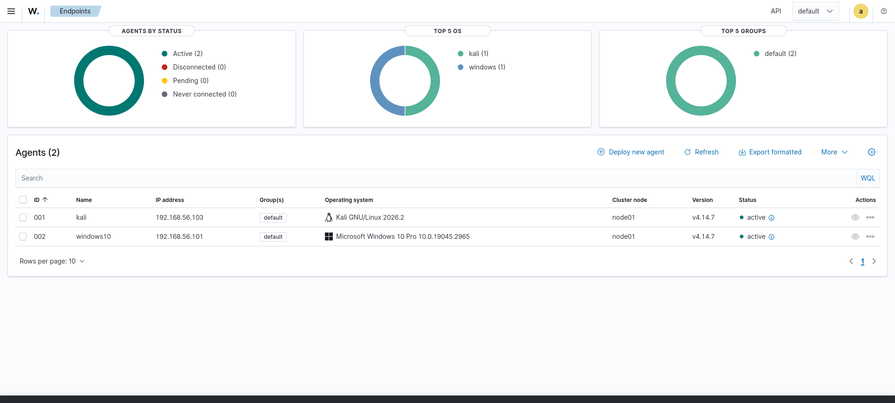
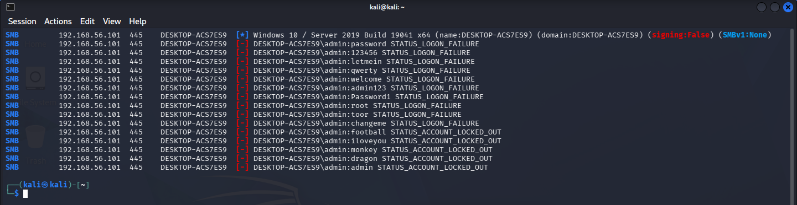
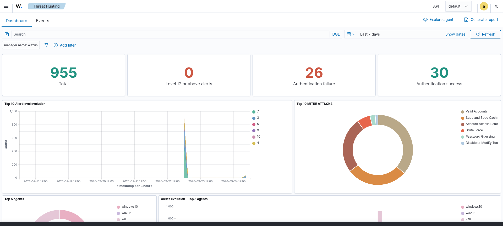
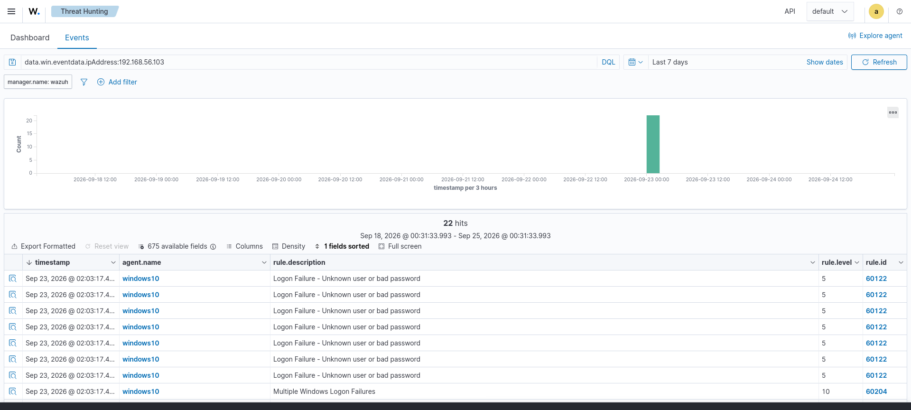

# Wazuh SIEM Home Lab — Detecting a Brute-Force Attack

A home lab I built to get hands-on practice with SOC basics. I set up
three virtual machines, ran a password-guessing attack from a Kali VM against a Windows machine, and
used Wazuh to detect and investigate it.

I built this to learn how security monitoring actually works instead
of just reading about it.

**Tools used:** VirtualBox, Ubuntu Server, Windows 10, Kali Linux, Wazuh 4.14, NetExec, MITRE ATT&CK

---

## Lab Setup

All three VMs are on an isolated VirtualBox host-only network (`192.168.56.0/24`), so nothing
touches the real internet.

| Role | Hostname | IP | OS | Software |
|------|----------|----|----|----------|
| SIEM / monitoring | wazuh-manager | `192.168.56.113` | Ubuntu Server 22.04 | Wazuh 4.14 (manager, indexer, dashboard) |
| Target | windows10 | `192.168.56.101` | Windows 10 Pro | Wazuh agent |
| Attacker | kali | `192.168.56.103` | Kali Linux | Wazuh agent + NetExec |

```
                 Host-only network 192.168.56.0/24
   ┌──────────────┐      ┌──────────────┐      ┌──────────────────────┐
   │  Kali        │      │  Windows 10  │      │  Ubuntu / Wazuh       │
   │ (attacker)   │      │  (target)    │      │  Manager + Indexer +  │
   │ .103         │      │  .101        │      │  Dashboard   .113     │
   │  NetExec ────┼─SMB─▶│  agent ──────┼─────▶│  collects & detects   │
   │  agent ──────┼──────┼──────────────┼─────▶│                       │
   └──────────────┘      └──────────────┘      └──────────────────────┘
        each machine runs a Wazuh agent that reports to the manager (.113)
```

---

## What I Did

1. Installed Wazuh 4.14 (manager, indexer, and dashboard) on the Ubuntu Server VM.
2. Installed Wazuh agents on the Windows and Kali VMs and connected them to the manager.
3. Confirmed both agents were reporting in and showing as **Active** in the dashboard.
4. Ran a brute-force attack and then looked at how Wazuh detected it.

**Both endpoints connected and active:**


---

## The Attack and the Detection

### 1. The attack (from Kali)
I opened SMB (port 445) on the Windows firewall and turned on logon auditing so failed logins get
recorded. Then I ran a password-guessing attack against the Windows `admin` account using
**NetExec** with a short list of common passwords:

```bash
nxc smb 192.168.56.101 -u admin -p passwords.txt
```

Each wrong password came back as `STATUS_LOGON_FAILURE`. After about 10 tries, Windows switched to
`STATUS_ACCOUNT_LOCKED_OUT` — the account-lockout policy on the Windows machine had kicked in and
locked the account.



### 2. What Windows logged
Every failed login created a Windows **Event ID 4625 (failed logon)**, and the Wazuh agent sent
those to the manager. Wazuh matched them to these rules:

| Wazuh Rule | Level | What it means |
|------------|-------|---------------|
| `60122` | 5 | Logon failure — wrong username or password (one per attempt) |
| `60204` | 10 | Multiple Windows logon failures (the brute-force alert) |
| `60115` | 9 | User account locked out |


### 3. Why the level-10 alert is the important one
One failed login isn't suspicious on its own, because people mistype passwords all the time. So each
failure is just a low-level alert (rule 60122, level 5). But when Wazuh sees several failures from
the same IP address in a short window, it combines them into one higher-severity alert
(rule 60204, level 10, "Multiple Windows Logon Failures"). Wazuh also tags that alert with the
MITRE ATT&CK technique it matches, **T1110 (Brute Force)**.



### 4. Investigating it
I opened the alert and filtered on the attacker's IP to confirm where the attack came from:

```
data.win.eventdata.ipAddress:192.168.56.103
```

That returned all the failed logins tied to the Kali VM. 



---

## Screenshots

| # | File | What it shows |
|---|------|---------------|
| 1 | [`01-kali-password-list.png`](screenshots/01-kali-password-list.png) | The password list I used |
| 2 | [`02-kali-bruteforce-nxc.png`](screenshots/02-kali-bruteforce-nxc.png) | The NetExec attack: failures, then account lockout |
| 3 | [`03-windows-lockout-policy.png`](screenshots/03-windows-lockout-policy.png) | The Windows account-lockout policy |
| 4 | [`04-wazuh-dashboard-overview.png`](screenshots/04-wazuh-dashboard-overview.png) | Wazuh overview with auth failures and MITRE ATT&CK |
| 5 | [`05-wazuh-bruteforce-alerts.png`](screenshots/05-wazuh-bruteforce-alerts.png) | The failed-login alerts and the brute-force alert |
| 6 | [`06-wazuh-attacker-ip.png`](screenshots/06-wazuh-attacker-ip.png) | Alerts filtered by the attacker's IP |
| 7 | [`07-wazuh-agents-active.png`](screenshots/07-wazuh-agents-active.png) | Both agents connected and active |

---

## A Problem I Ran Into

The Wazuh dashboard part of the install kept freezing partway through and looked stuck for a long
time. After troubleshooting, I learned that Wazuh is heavy on disk and memory, and my Wazuh VM's
disk was slow. Turning on VirtualBox's **Host I/O Cache** for that VM and adding a **swap file**
fixed it, and the install finished.

Takeaway: give the Wazuh VM plenty of RAM and, if you can, put it on an SSD.

---

## What I Learned
- A single, combined alert is much more useful than a flood of raw events. That's the point of a SIEM.
- Two things worked together here: the Windows lockout policy *slowed* the attack, and Wazuh
  *detected* it. Having layers like that is called defense in depth.
- Investigating an alert means figuring out who (source IP), what (the technique), and where
  (which account was targeted).
- SIEM tools need real resources; disk and memory sizing actually matters.

## If I Kept Building On This
- A slower, more patient attacker (a few guesses per hour) would stay under the brute-force
  threshold and might not trigger the level-10 alert. Catching that would need a different rule.
- Add File Integrity Monitoring to detect changed files.
- Add Sysmon on Windows for more detailed logs.
- Set up email/Slack alerts and automatic blocking of an attacker's IP.

---

## Skills I Practiced
Setting up and networking VMs in VirtualBox · installing and configuring Wazuh and its agents ·
running a brute-force attack with NetExec over SMB · reading Windows security logs (Event ID 4625) ·
understanding how Wazuh correlates events and maps them to MITRE ATT&CK · investigating an alert to
find the source · basic Linux troubleshooting.

---

## About Me
**Wyatt Hickey** — learning cybersecurity and working toward a SOC / security analyst role.
GitHub: [@wyatthickey](https://github.com/wyatthickey)

*This was a personal learning project. Everything was done on isolated VMs that I own.*
